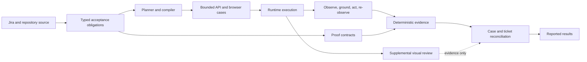

# ango-scholars-qa-agent

A QA automation agent that turns Jira requirements and repository context into safe API and browser test execution with deterministic evidence.

> **Execution is not proof.**

The agent keeps five concerns separate: source requirements establish authority; planned cases describe bounded work; runtime execution gathers observations; deterministic proof evaluates typed evidence; and verdicts report only what the evidence can support. Screenshots and review remain useful supplemental evidence, but never replace source authority or deterministic proof.

## What it does

- Plans and materializes API and browser cases from Jira requirements and repository context.
- Resolves routes, runtime context, entities, and compatible fixture state through bounded, typed paths.
- Executes safe API checks and semantic browser interactions.
- Captures traces, screenshots, video, runtime observations, and deterministic evidence.
- Binds proof contracts to source-backed obligations before granting a canonical result.
- Reports `PASS`, `FAIL`, `BLOCKED`, `MANUAL_REQUIRED`, and `ERROR` without converting uncertainty into a pass.

`BLOCKED` and `MANUAL_REQUIRED` are intentional outcomes: they preserve the distinction between an unexecutable or insufficiently provable case and a verified product result.

## High-level architecture



The central boundary is:

```text
REQUIREMENT
!= CASE EXISTENCE
!= INTERACTION EXECUTION
!= DETERMINISTIC PROOF
!= VISUAL REVIEW
!= FINAL VERDICT

EXECUTED != PROVED
```

## Generic browser behavior

The browser agent uses a bounded loop: observe the current surface, ground one safe semantic action, execute it, and re-observe. It relies on semantic and accessibility-oriented runtime information rather than product scripts, `nth` selectors, DOM order, CSS/framework identifiers, or pixel/proximity heuristics.

An ambiguous target fails closed. A model result such as `GOAL_ALREADY_SATISFIED` can trigger deterministic evaluation only when an appropriate typed source-backed requirement and contract already exist; it is never proof on its own. The final accepted route and proof scope come from runtime binding and source-backed contracts, not from planner prose alone.

## Quick start

```bash
npm install
npx tsc --noEmit

# Plan one Jira issue through the configured integration.
npm run plan -- --issue AS-1234

# Run the configured API/browser workload or focused browser workflow.
npm run run
npm run browser

# Run the project's smoke workflow.
npm run smoke
```

Service URLs, model configuration, credentials, and mutation permissions are environment-specific. Do not print or commit secrets. Keep mutation and fixture-provisioning permissions disabled unless a specific run has explicit authorization. Generated `qa-results/` artifacts are local evidence; they are not planner or source inputs to edit by hand.

## Safety, evidence, and fixtures

A canonical `PASS` requires applicable source authority, a typed execution/proof contract, accepted fresh runtime context, deterministic evidence, and a clean runtime audit. A `FAIL` likewise needs sufficient deterministic contradiction; incomplete observation remains fail-closed rather than becoming a product-bug claim.

Fixture support is meaningful where it can safely consume compatible state, resolve supported runtime state, and bind exact entities. It deliberately fails closed on ambiguity. Generic unattended fixture construction and universally proven cleanup are not production-ready.

> Permission to create test data is not the same as authority to decide what requirement-valid test data should look like.

The remaining fixture problem is typed construction authority and isolated lifecycle management—not merely the ability to issue `POST` requests.

## Evidence examples

- **AS-1058 — positive proof.** Fresh31 used source-bound literal checks and granted `PASS` only after every required assertion was deterministically satisfied.
- **AS-1311 — false-PASS prevention.** The model reported `GOAL_ALREADY_SATISFIED`, but deterministic evidence contradicted the source-authorized `Download as PDF` assertion. The model statement therefore did not produce `PASS`.

## Current validation state

The frozen Fresh31 cohort contains 31 plans and 37 runtime cases:

| Result | Count |
| --- | ---: |
| `PASS` | 2 |
| `FAIL` | 1 |
| `BLOCKED` | 25 |
| `MANUAL_REQUIRED` | 9 |
| `ERROR` | 0 |

Runs A → B had no status delta; B → C had no status or technical delta; PASS asymmetry was zero. The result is **`STABLE_CASE_AND_TECHNICAL`**: frozen-cohort reproducibility, not a 37/37 pass rate or product-wide certification.

The final usefulness census found that the dominant blockers were missing source authority, unavailable runtime fixtures/prerequisites, and genuinely manual or visual checks. It did not identify one small generic safe patch that would honestly unlock multiple fixture-ready cases.

## Historical Final-13

Final-13 is historical canonical compatibility evidence, not the current strict PASS floor. Its eight historical PASS results reconcile as three `FIXTURE_DRIFT`, three `LEGACY_FALSE_OR_WEAK_PASS`, and two `BENCHMARK_MIGRATION_GAP`; the final forensic found zero `TRUE_AGENT_REGRESSION` and zero `INSUFFICIENT_EVIDENCE` classifications.

The fixture cases no longer had compatible runtime prerequisites. Three historical passes used weaker legacy evidence or ownership semantics, while two AS-1058 cases need benchmark/source-provenance migration even though the modern AS-1058 proof capability works in Fresh31. See the [Final handoff](docs/final-handoff.md) and [Regression runbook](docs/regression-runbook.md) for the complete accounting.

## Known limitations

- Unattended generic fixture construction is not production-ready.
- Some capabilities have narrower, controlled, synthetic, or historical proof coverage.
- Fixture and environment availability materially affect end-to-end completion.
- Some acceptance criteria are genuinely visual or manual.
- Historical benchmark representations may need explicit provenance migration before comparison with the current proof architecture.

These are engineering boundaries that keep results honest, not omitted work or silent fallbacks.

## Documentation

| Document | Purpose |
| --- | --- |
| [Architecture](docs/architecture.md) | Authority boundaries and runtime pipeline |
| [Regression runbook](docs/regression-runbook.md) | Fresh31 and Final-13 procedure |
| [Final handoff](docs/final-handoff.md) | Evidence inventory, limitations, and priorities |
| [Demo script](docs/demo-script.md) | 5–10 minute evidence-based walkthrough |
| [ADR-001](docs/ADR-001-browser-agent.md) | Original browser-agent decision and historical context |
| [HANDOFF.md](HANDOFF.md) | Current handoff entry point |
