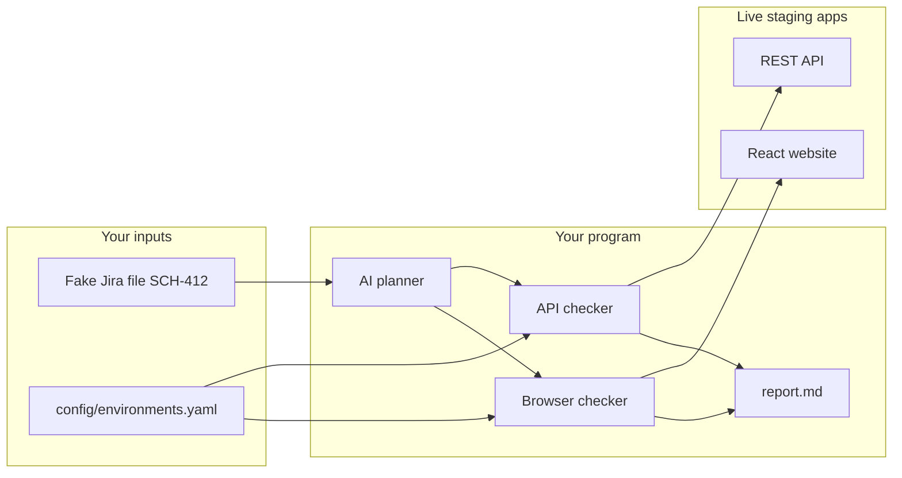

# Assignment — QA Agent

**Project:** `ango-scholars-qa-agent`  
**Stack:** TypeScript, Node.js, Playwright, Ollama Cloud

---

You will build a small **command-line testing tool** for our hiring platform, Ango Scholars.

You do **not** need prior experience with Jira, Playwright, or AI agents. If you know basic TypeScript and how to use the terminal, you are in good shape.

This document is everything you need to get started. **Fixture files** (fake ticket data) are included as separate attachments — copy them into your project as described below.

When you are finished, send me your GitHub repo link and a short demo (terminal recording or screenshots).

---

## Your goal

Build a program you run from the terminal that:

1. Reads a **fake bug ticket** (no Jira account needed yet)
2. Asks an **AI** (Ollama Cloud) what to test
3. Checks the **live staging website** and **API**
4. Writes a **report** with results and screenshots

Think of it as a homework grader: the ticket says what should work, your program checks if it does.

Work through the phases below **in order**. Each phase has a clear “done” check before you move on.

---

## What you will learn

- TypeScript and building a CLI with Node.js
- HTTP requests with `fetch` (API testing)
- Browser automation with Playwright
- Calling an LLM API and parsing JSON
- Writing a simple test report in Markdown

---

## What you need


| Item                 | How to get it                                  |
| -------------------- | ---------------------------------------------- |
| Node.js 24           | [nodejs.org](https://nodejs.org/)              |
| Git + GitHub account | Create your own repo for this project          |
| Ollama Cloud API key | **Ask me** — I will send this to you privately |
| Code editor          | VS Code or similar                             |


## What you do not have yet (that is OK)

- Jira login
- Access to our  codebase
- Real staging login passwords

You will use **fixture files** (attached) and **mock login** for now. I will help you connect real Jira and Firebase later.

---

## Materials included with this assignment

Copy these into your repo under `fixtures/` (keep the same folder names):


| File                                 | Purpose                                   |
| ------------------------------------ | ----------------------------------------- |
| `fixtures/jira/SCH-412.json`         | Ticket data (JSON)                        |
| `fixtures/jira/SCH-412.md`           | Same ticket as readable text (for the AI) |
| `fixtures/change-context/SCH-412.md` | Summary of what code changed              |
| `fixtures/diff/SCH-412-files.txt`    | List of changed files                     |
| `fixtures/diff/SCH-412.patch`        | Sample code diff                          |


---

## Quick glossary


| Term              | Meaning                                                                                        |
| ----------------- | ---------------------------------------------------------------------------------------------- |
| **Staging**       | A test copy of the app — safe to experiment, not the real production site.                     |
| **Fixture**       | A fake file that pretends to be a Jira ticket. You read it from disk.                          |
| **Smoke test**    | A quick check that something loads — not a full deep test.                                     |
| **CLI**           | A program you run in the terminal, e.g. `npm run plan`.                                        |
| **API**           | The backend server. You talk to it with HTTP (`GET`, `POST`, etc.).                            |
| **API agent**     | Your code that sends HTTP requests and checks responses.                                       |
| **Browser agent** | Your code that opens Chrome and navigates the site like a user.                                |
| **LLM**           | The AI you call through Ollama Cloud.                                                          |
| **PASS**          | Test ran and succeeded.                                                                        |
| **BLOCKED**       | Test could not run (e.g. no login yet). **Not a failure on your part** — note it and continue. |
| **FAIL**          | Test ran but the app behaved incorrectly.                                                      |


---

## The example ticket

**Ticket ID:** `SCH-412`

**User story:** A company admin should be able to download their company's skills list as a **CSV file** from the Skills page.

**Your job:** Build a tool that *would* verify this feature once we add real login. For now, use the attached fixture files and mock auth.

### Acceptance criteria

- On `/company/skills`, an **Export** (or Download CSV) button is visible for company admins.
- Clicking Export calls `GET /skills/export-csv` and downloads a CSV with columns like category, mainDiscipline, secondaryDiscipline.
- Talent users and logged-out users **cannot** use the export endpoint.
- Success shows a download or toast; errors show a message to the user.

---

## How your program fits together




**Staging URLs** (live and public — you can open them in a browser today):

- Website: `https://scholars-client-575683486613.us-east1.run.app`
- API: `https://scholars-server-575683486613.us-east1.run.app`

**Two user types** you will eventually test as:


| Persona         | Who they are           | Example pages                       |
| --------------- | ---------------------- | ----------------------------------- |
| `talent`        | Job seeker             | `/talent/dashboard`, `/talent/jobs` |
| `company_admin` | Company hiring manager | `/company/skills`, `/company/jobs`  |


---

## Phase 1 — Get the project running

**Goal:** A repo that reads the fake ticket and prints its title. No AI, no browser yet.

### Checklist

- [ ] **1.** Create a GitHub repo named `ango-scholars-qa-agent`. Add `README.md`, `.gitignore` (`node_modules/`, `.env`, `qa-results/`), and `LICENSE` (MIT is fine).

- [ ] **2.** Set up TypeScript (ES modules):
  - `package.json` with `"type": "module"`
  - `tsconfig.json` with `"strict": true`
  - Dev deps for now: `tsx`, `typescript`, `@types/node`
  - You will add Playwright and other packages in **Phase 2**

- [ ] **3.** Copy the attached `fixtures/` folder into your repo.

- [ ] **4.** Create `config/environments.yaml`:

```yaml
default_target: staging
environments:
  staging:
    url: https://scholars-client-575683486613.us-east1.run.app
    api_url: https://scholars-server-575683486613.us-east1.run.app
```

- [ ] **5.** Create `config/personas.yaml` with `talent` and `company_admin` (placeholder emails are fine, e.g. `qa-talent@example.com`).

- [ ] **6.** Create `.env.example`:

```bash
OLLAMA_API_KEY=
OLLAMA_BASE_URL=https://ollama.com/v1
OLLAMA_MODEL=

# I will provide these later
JIRA_BASE_URL=
FIREBASE_SERVICE_ACCOUNT_KEY=
QA_TALENT_EMAIL=
QA_COMPANY_EMAIL=

# Use mock login until Firebase is wired up
QA_AUTH_MODE=mock
```

- [ ] **7.** Create `src/cli.ts` with a `plan` command:

```bash
npm run plan -- --fixture SCH-412
```

For Phase 1, this should only read `fixtures/jira/SCH-412.json` and print the ticket key and summary. **No LLM call yet.**

- [ ] **8.** Write a README: how to clone, `npm install`, and run `npm run plan`.

### Phase 1 done when

I can run:

```bash
git clone <your-repo-url>
cd ango-scholars-qa-agent
npm install
npm run plan -- --fixture SCH-412
```

…and see:

```text
SCH-412: Company admin can export skills taxonomy as CSV from Skills page
```

**Send me your repo link when Phase 1 is done** so I can check progress before you continue.

---

## Phase 2 — Make it test something

**Goal:** Full pipeline — AI test plan → API checks → browser checks → report.

Install additional packages:

```bash
npm install playwright @browserbasehq/stagehand openai zod yaml commander
npx playwright install chromium
```

Add to `package.json`:

```json
"scripts": {
  "plan": "tsx src/cli.ts plan",
  "run": "tsx src/cli.ts run",
  "smoke": "tsx src/cli.ts smoke"
}
```

Put your Ollama API key in `.env` (I will send the key separately — **never commit `.env`**).

Complete the three parts below in order.

---

### Part A — AI writes a test plan

Send the ticket text to Ollama Cloud. The AI returns a JSON list of tests to run.

**Create these files:**

- `src/planner/types.ts`
- `src/planner/plan-from-fixture.ts`
- `src/llm/ollama-client.ts` — OpenAI SDK pointed at Ollama Cloud

**Types:**

```typescript
// One HTTP test
export type ApiTestCase = {
  id: string;
  persona: "talent" | "company_admin";
  method: "GET" | "POST" | "PATCH" | "DELETE";
  path: string;
  body?: unknown;
  expect: { status: number; contentType?: string; notes?: string };
};

// One browser test
export type BrowserTestCase = {
  id: string;
  persona: "talent" | "company_admin";
  goal: string;
  startRoute: string;
  successCriteria: string;
};

// Full plan for one ticket
export type TestPlan = {
  issueKey: string;
  summary: string;
  apiCases: ApiTestCase[];
  browserCases: BrowserTestCase[];
};
```

**Planner reads:**

- `fixtures/jira/SCH-412.md`
- `fixtures/change-context/SCH-412.md`
- `fixtures/diff/SCH-412-files.txt`

**Tell the AI (system prompt):**

- At least 2 API cases and 2 browser cases
- Include `GET /skills/export-csv` for `company_admin`
- Include checking `/company/skills` for an Export button
- No destructive actions or production URLs

**Output:** `qa-results/test-plan.json`

**Your plan should look roughly like this:**


| ID    | Type    | What to test                                               |
| ----- | ------- | ---------------------------------------------------------- |
| api-1 | API     | `GET /skills/export-csv` as company_admin → 200 + CSV      |
| api-2 | API     | Same URL as talent → 401 or 403                            |
| web-1 | Browser | Staging login page loads                                   |
| web-2 | Browser | `/company/skills` — Export button visible (when logged in) |


---

### Part B — API checker

Loop through `apiCases`, call `fetch(api_url + path)`, record status codes.

**File:** `src/agents/api/run-api-cases.ts`

**Auth stub** (`src/auth/index.ts`):

```typescript
export type Persona = "talent" | "company_admin";

export interface AuthProvider {
  getIdToken(persona: Persona): Promise<string>;
}
```

Implement `MockAuthProvider` (fake token). Add `// TODO: FirebaseAuthProvider` for later.

> **Important**
>
> Without real login, protected endpoints return **401**. Mark those tests **BLOCKED** ("waiting for login"), **not FAIL**. FAIL means the test ran and the app was wrong.

---

### Part C — Browser checker and report

Playwright opens headless Chrome, visits staging, saves screenshots.

**File:** `src/agents/browser/run-browser-cases.ts`

**Minimum:**


| Test  | Action                               | Expected result                                                |
| ----- | ------------------------------------ | -------------------------------------------------------------- |
| web-1 | Open `/account/login`                | **PASS** — save `qa-results/evidence/01-login.png`             |
| web-2 | Open `/company/skills` without login | **BLOCKED** — redirect to login; save `02-skills-redirect.png` |


**Evidence manifest** (`qa-results/evidence-manifest.json`):

```json
[
  {
    "step": 1,
    "title": "Login page loads",
    "result": "PASS",
    "filename": "01-login.png",
    "notes": ""
  }
]
```

**Report** (`qa-results/report.md`) — example rows:

```markdown
## QA Report

| # | Test Case | App | Persona | Result | Notes |
| --- | --- | --- | --- | --- | --- |
| 1 | Login page loads | web | n/a | :white_check_mark: PASS | 01-login.png |
| 2 | GET /skills/export-csv | api | company_admin | :no_entry: BLOCKED | 401 — no real login yet |
| 3 | Export on Skills page | web | company_admin | :no_entry: BLOCKED | Cannot log in yet |
```

**Result labels:**


| Label                          | When                       |
| ------------------------------ | -------------------------- |
| `:white_check_mark: PASS`      | Test ran and succeeded     |
| `:x: FAIL`                     | Test ran; app was wrong    |
| `:no_entry: BLOCKED`           | Test could not run         |
| `:warning: FLAKY`              | Intermittent (rare)        |
| `:grey_question: INCONCLUSIVE` | Unclear — explain in Notes |


`**run` command flow:**

```text
run --fixture SCH-412
  → load fixtures
  → create or load test-plan.json
  → run API checker
  → run browser checker
  → write report.md
```

### Phase 2 done when

```bash
npm run run -- --fixture SCH-412
ls qa-results/
```

You have: `report.md`, `test-plan.json`, `evidence/*.png`, `evidence-manifest.json`.

---

## Target folder structure

```text
ango-scholars-qa-agent/
├── .env.example
├── README.md
├── package.json
├── tsconfig.json
├── config/
│   ├── environments.yaml
│   └── personas.yaml
├── fixtures/
│   └── ... (attached files)
├── docs/
│   └── ADR-001-browser-agent.md
├── src/
│   ├── cli.ts
│   ├── llm/ollama-client.ts
│   ├── planner/
│   ├── auth/
│   ├── agents/api/
│   ├── agents/browser/
│   ├── reporting/
│   └── jira/          ← empty stubs OK
└── qa-results/        ← gitignored
```

---

## Out of scope for now

Do not build these yet — leave `// TODO` stubs if helpful:

- Real Jira integration
- Posting reports to Jira
- GitHub Actions CI
- Real Firebase login

---

## Rules — ask me first before you…

- Test **production** (`scholars.net`) — **staging only**
- Create or delete data on staging
- Add large frameworks (e.g. LangChain)

---

## Helpful links

- [Playwright — getting started](https://playwright.dev/docs/intro)
- [Stagehand docs](https://docs.stagehand.dev/)
- [Ollama Cloud](https://ollama.com/cloud)
- [OpenAI Node SDK](https://github.com/openai/openai-node) (works with Ollama's compatible API)

