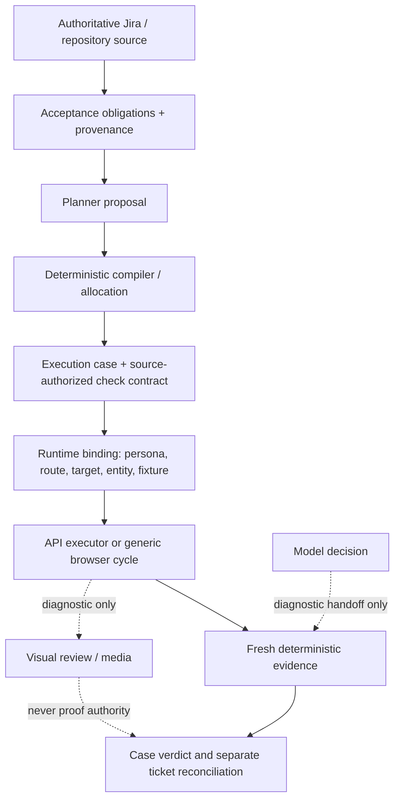

# Architecture and authority model

## Core distinction

```text
SOURCE REQUIREMENT != RUNTIME OBSERVATION != DETERMINISTIC EVIDENCE != FINAL VERDICT
REQUIREMENT != CASE EXISTENCE != INTERACTION EXECUTION != DETERMINISTIC PROOF != VISUAL REVIEW != FINAL VERDICT
EXECUTED != PROVED
```

The agent is designed to report only what the available authority supports. Planner prose, browser success, screenshots, and model confidence may guide work or diagnosis; none creates verdict authority.

## Pipeline



The planner may supply a `startRoute` as a navigation seed. It cannot independently authorize a source target, accepted proof route, or final verdict. A case defines bounded execution, while a verdict scope defines coverage; neither silently drops obligations.

## Generic browser runtime

The browser agent performs a bounded loop:

1. Observe the current semantic surface.
2. Ground one safe actionable target.
3. Perform the policy-approved interaction.
4. Re-observe and bind fresh evidence.

It fails closed when grounding is ambiguous. It does not rely on product-specific scripts, issue-specific branches, `nth` selectors, DOM order, CSS/framework identifiers, or pixel/proximity heuristics. Persona, accepted route, target/entity, and fixture state are runtime facts; a configured session cannot manufacture a compatible entity or fixture.

## Proof and verdict

Source-bound assertion sets bind source-authorized literal members to stable check IDs and fresh evidence. AS-1058 is current real-UI evidence for that supported shape. Structural-control and route/action capabilities are deliberately narrower and must also have typed source authority plus accepted runtime context.

A model `GOAL_ALREADY_SATISFIED` result may trigger deterministic evaluation only when an eligible typed check exists. Screenshot/video review is diagnostic, not proof. AS-1311 demonstrates the boundary: the model reported `GOAL_ALREADY_SATISFIED`, but the source-authorized `Download as PDF` check failed, yielding `FAIL` rather than a false PASS.

Verdicts consume required checks, exact evidence bindings, runtime context, and the completed safety audit. Persistence, product-request, test-data, mutation, fixture, and entity signals remain fail-closed. A discovery support shell with no acceptance obligations can retain telemetry but has no canonical case verdict and cannot PASS or discharge obligations.

`PASS` requires complete applicable proof. `FAIL` requires a grounded contradiction. `BLOCKED` records a missing prerequisite, `MANUAL_REQUIRED` records insufficient deterministic authority/evidence, and `ERROR` records infrastructure failure. These are intentional distinctions, not score categories.
